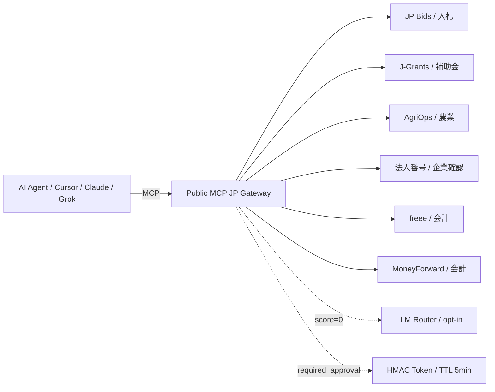
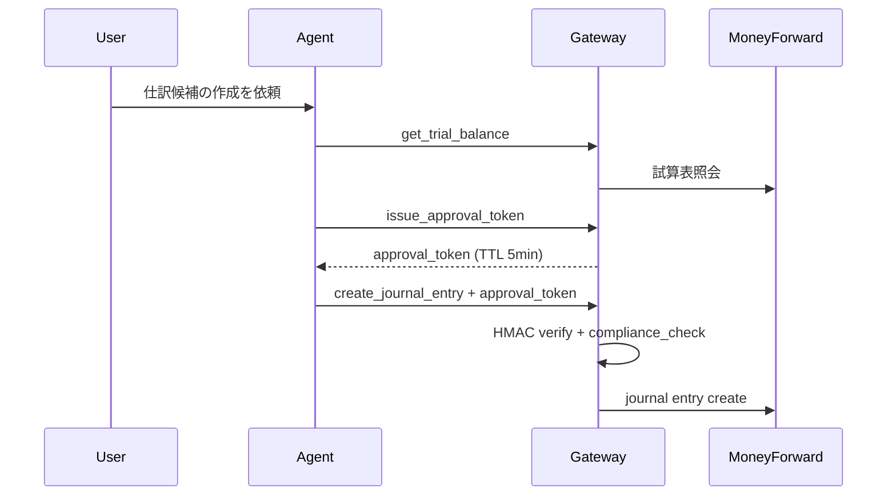

## TL;DR

Public MCP JP Gateway は、JP Bids MCP、J-Grants MCP、AgriOps MCP、法人番号 MCP、freee MCP、MoneyForward Cloud Accounting MCP を 1 つの MCP エンドポイントに束ねる TypeScript 製 Gateway です。GMO銀行系APIは公開 Gateway では提供せず、利用許諾とAPI取得が完了した後の private connector として追加予定です。

- child MCP は `gateway/config/registry.json` に宣言する
- `tool_modes` は固定 enum ではなく registry-driven な動的 mode にした（ADR-0022）
- `tool_modes` で LLM に見せる tool surface を絞る（ADR-0017）
- read-only な public data は TTL cache する（ADR-0018）
- 書き込み系 tool は HMAC Approval Token + compliance check で二重ロックする（ADR-0019）
- routing は rule-based を優先し、score=0 のときだけ LLM fallback する（ADR-0020）

業務寄りの背景とストーリーは note 版に分けました。この記事では実装と設計判断に絞ります。

---

## 最初の問題 — AI に渡すツールが増えすぎる

MCP Gateway が必要になる最初の理由は、MCP サーバーが増えるほど AI クライアント側の責務が破裂することです。

JP Bids MCP だけなら、Cursor や Claude Desktop が直接つなげば十分です。J-Grants も、AgriOps も、法人番号も、freee も、MoneyForward も、単体なら直接つなげます。しかし複数本を同じ会話で扱う設計にすると、認証、rate limit、監査ログ、tool surface、routing の問題が一気に出てきます。

特に freee MCP は単体で約 270 ツールを持ちます。J-Grants、JP Bids、MoneyForward などを足すと、LLM に 300 以上の tool definition を渡す構成になり得ます（出典: [ADR-0017 Dynamic Tool Surface](https://github.com/sugukurukabe/koko-call-mcp/blob/main/docs/adr/0017-dynamic-tool-surface.md)）。

これは単にコンテキストが長いという話ではありません。入札検索だけをしたいエージェントに、会計の請求書作成ツールや仕訳作成ツールを見せる理由はありません。

---

## 全体アーキテクチャ — 1つの MCP endpoint が複数の child MCP を代理する

Public MCP JP Gateway は、MCP クライアントから 1 endpoint として呼ばれ、内部で registry に定義された child MCP へ proxy します。



この図の中心は Gateway です。MCP client は Gateway だけを見て、Gateway が child MCP を代理します。

ADR-0016 では、Gateway を JP Bids MCP 本体とは別 package にしました。

```text
Koko-call-mcp/
├── src/                  ← JP Bids MCP 本体
├── gateway/              ← Public MCP JP Gateway
│   ├── config/registry.json
│   ├── src/router/
│   ├── src/policy/
│   ├── src/proxy/
│   └── src/tools/
└── docs/adr/
```

読み取り専用の公共データ MCP と、会計を含む financial Gateway は、リスクプロファイルが違います。そのため、同じ `src/` には混ぜませんでした。これは ADR-0016 の中心的な判断です。

---

## Registry-driven child MCP 管理

child MCP の追加は `gateway/config/registry.json` への 1 エントリ追加で完結する設計にしました。

| id | risk_level | auth_type | 主な用途 |
|---|---|---|---|
| `jp-bids` | `read_only` | `bearer_apikey` | 官公需入札 |
| `jgrants` | `read_only` | `none` | 補助金 |
| `agriops` | `read_only` | `none` | 農業・自治体統計 |
| `houjin-bangou` | `read_only` | `bearer_apikey` | 法人番号・法人基本情報 |
| `freee` | `financial` | `bearer_oauth` | 会計 |
| `moneyforward-ca` | `financial` | `bearer_oauth` | 仕訳・試算表・推移表 |

`agriops` は Phase 1 の read-only child MCP として追加しました。

```json
{
  "id": "agriops",
  "risk_level": "read_only",
  "tool_modes": {
    "agri_research": ["get_municipality_stats"],
    "municipality_analysis": ["get_municipality_stats"],
    "financial_check": [],
    "full_orchestration": []
  },
  "cache_ttl_seconds": 300
}
```

GMO銀行系APIについては、公開Gatewayの registry から外しています。社内利用に限定されるAPIを公開機能として見せると、利用許諾と提供範囲の誤解を生むためです。利用許諾とAPI取得が完了した場合だけ、private connector として別枠で追加する方針です。

本番では `GATEWAY_CHILD_ENDPOINT_AGRIOPS` や `GATEWAY_CHILD_ENDPOINT_HOUJIN_BANGOU` で endpoint を上書きします。子 MCP 追加でコード変更が必要なら、まず registry 設計を疑います。

---

## Dynamic Tool Surface — mode で tool list を狭くする

Dynamic Tool Surface は、Agent の目的に応じて LLM に見せる tool list を絞る仕組みです。

優先順位は単純にしました。

```text
tool_modes[mode] → tool_allowlist → 全ツール許可
```

| mode | 目的 | 見せるもの |
|---|---|---|
| `bid_search` | 入札検索 | JP Bids の検索・ランキング系 |
| `subsidy_search` | 補助金検索 | J-Grants の検索・詳細系 |
| `financial_check` | 財務確認 | freee / MoneyForward の read 系 |
| `agri_research` | 農業・自治体分析 | AgriOps / e-Stat の read 系 |
| `municipality_analysis` | 自治体データ横断 | AgriOps / e-Stat の read 系 |
| `full_orchestration` | 統合判断 | allowlist + 明示許可 tool |

`list_connected_servers(mode: "financial_check")` を呼ぶと、財務確認に必要な tool surface だけを表示します。`agri_research` を呼べば AgriOps 側の農業・自治体ツールだけを表示できます。

これで freee の 270 ツール問題を Gateway 側で吸収できます。LLM に全部見せるのではなく、目的別に必要なものだけ見せます。

---

## Cache Strategy — 入札・補助金は cache、会計は cache しない

Gateway は child MCP の前段に立つため、同じ query が複数 agent から繰り返されます。

ADR-0018 の方針は、read-only / idempotent な public data だけ TTL cache することです。

| server_id | TTL / policy |
|---|---|
| `jp-bids` | 60 秒 |
| `jgrants` | 300 秒 |
| `agriops` | 300 秒 |
| `freee` | cache 禁止 |
| `moneyforward-ca` | `financial` のため cache 禁止 |

実装上も `server.risk_level !== "financial"` を cache 条件にしています。

```typescript
const isCacheable =
  !bypassCache && ttl !== undefined && ttl > 0 && server.risk_level !== "financial";
```

入札・補助金・農業統計は cache し、会計データは cache しません。ここは業務上の鮮度とコストの境界としてかなり重要です。

---

## Smart Router — rule first, LLM fallback second

Smart Router は最初から LLM に任せません。

理由はコスト、レイテンシ、予測可能性です。まず registry の `routing_keywords` で deterministic に選びます。score が 0 のときだけ、`GATEWAY_ROUTER_LLM_FALLBACK=true` なら Claude Haiku に fallback します。

実装上は `explicitServerId` を最優先し、次に `registry.routing_keywords` で score を計算します。最大 score が 0 のときだけ `routeViaLlm(context.query, servers)` を呼びます。

LLM fallback は query の SHA-256 を key に 1 時間 cache します。通常時の routing cost は 0 のまま、未知の表現だけ拾えます。

---

## Approval Token — 書き込み系 tool は token なしで実行できない

Approval Token は、仕訳作成・更新など副作用のある tool に対する HMAC 署名付きの短命 token です。

```json
"tool_policies": {
  "create_journal_entry": {
    "required_approval": true,
    "compliance_check": ["accounting_period_open"]
  }
}
```



`create_journal_entry` のような書き込み系 tool 実行前に `issue_approval_token` を挟みます。token は args と tool_name に束縛され、TTL 5 分で失効します。

なぜ JWT ではなく HMAC か。ADR-0019 ではこう判断しました。

| 選択肢 | 判断 |
|---|---|
| JWT | 鍵ローテーション・alg 管理が過剰 |
| DB-backed approval | Cloud Run stateless 性と相性が悪い |
| HMAC token | 同一 service 内の短命 token には十分 |

TTL は 300 秒です。短すぎると multi-agent flow 中に切れます。長すぎると replay risk が上がります。5 分は、人間の確認と実行に必要な余裕を残しつつ、リスクを抑える妥協点にしました。

---

## Gateway tools — ユーザーに見せる表面は少なくする

Gateway 自体が expose する tool は少なくしています。

| tool | tier | 役割 |
|---|---|---|
| `list_connected_servers` | Free | child MCP と tool を mode 付きで表示 |
| `search_public_opportunities` | Free | JP Bids + J-Grants を横断検索 |
| `analyze_funding_fit` | Pro | 入札 + 補助金 + 会計の適合分析 |
| `call_registered_mcp` | Pro | child MCP の tool を直接呼ぶ |
| `get_audit_events` | Pro | 自分の audit log を取得 |
| `issue_approval_token` | Pro | required_approval tool 用 token を発行 |

Cursor からは Gateway だけを設定します。

```json
{
  "mcpServers": {
    "public-mcp-jp": {
      "url": "https://public-mcp-jp-gateway-397249937286.asia-northeast1.run.app/mcp"
    }
  }
}
```

---

## セキュリティモデル — Tier × Risk × Mode × Policy

Public MCP JP Gateway の security model は 4 層に分けました。

| 層 | 実装 | 目的 |
|---|---|---|
| Tier | Free / Pro | Gateway tool の露出制御 |
| Risk | `read_only` / `read_write` / `financial` | child MCP の危険度分類 |
| Mode | `bid_search` / `subsidy_search` / `financial_check` / `agri_research` / `full_orchestration` | tool surface の最小化 |
| Per-tool policy | `required_approval` / `compliance_check` | 副作用 tool の二重ロック |

加えて audit log は actor hash と decision を残し、入力全文や財務データは保存しない方針にしています（出典: [feasibility.md](https://github.com/sugukurukabe/koko-call-mcp/blob/main/docs/public-mcp-hub/feasibility.md)）。

---

## 世界の MCP Gateway 事情と、このプロジェクトの位置

MCP Gateway はすでに世界で category になり始めています。

| category | examples | focus | Japan public data |
|---|---|---|---|
| Security Gateway | PingGateway, Permit MCP Gateway | authz, policy, audit | no |
| Agent Gateway | agentgateway, Kuadrant/mcp-gateway | routing, L7 gateway | no |
| Public data MCP | JP Bids MCP, J-Grants MCP | domain-specific public data | yes |
| Federation Hub | Public MCP JP Gateway | Japan public data + SaaS federation | yes |

この Gateway の狙いは、世界の gateway 実装と真正面から競うことではありません。日本の public procurement、subsidy、agriculture、corporate registry、accounting を 1 つの agent-native workflow に束ねることです。

---

## テストと現在の状態

実装後の local check は次の通り。

```text
Test Files  8 passed (8)
Tests       56 passed (56)
Connected servers include: jp-bids, jgrants, agriops, freee, moneyforward-ca, houjin-bangou
```

GMO銀行系APIは、現時点の公開 Gateway では提供していません。利用許諾とAPI取得が完了した後、社内利用または契約範囲内の private connector として追加する予定です。

この判断は単なる実装都合ではなく、公開Gatewayとprivate connectorの境界を明確にするためのものです。運用方針は [`docs/public-mcp-hub/gmo-banking-private-connector.md`](https://github.com/sugukurukabe/koko-call-mcp/blob/main/docs/public-mcp-hub/gmo-banking-private-connector.md) に分けました。

---

## 今後の展望 — Expansion Packs（ADR-0022）

ADR-0022 で、child MCP の段階投入と mode の一般化を決定しました。

| Phase | child MCP | risk_level | 主な価値 |
|-------|-----------|------------|----------|
| 1 | AgriOps（`@sugukuru/agriops-mcp`） | `read_only` | 農業・自治体・地域文脈 |
| 2 | 法人番号 MCP（国税庁 Web-API） | `read_only` | 法人実在確認・取引先照合 |
| 3 | e-Stat / RESAS MCP | `read_only` | 人口・産業・就業・地域経済 |
| 4 | e-Gov 法令検索 MCP | `read_only` | 法令・行政手続の一次情報参照 |
| 5 | SSW / Visa MCP | `read_only`（初期） | 在留期限・届出・配置可否 |

Phase 1 の AgriOps は registry 追加済みで、確認済み tool の `get_municipality_stats` を `agri_research` / `municipality_analysis` mode で公開します。mode の一般化により、固定 enum ではなく registry.json の `tool_modes` キーで mode を定義する形に移行しました。新しい child MCP を追加するとき、`schema.ts` や `tool-filter.ts` のコード変更は不要になりました。

gBizID やマイナンバー/JPKI は初期 MVP に入れません。行政サービス連携申請、本人確認、委託先管理、特定個人情報の制限が絡むためです。

知っているだけでは足りません。registry に落ち、policy に落ち、test に通って初めて、AI エージェントは制度の中を歩けます。

---

## References

- note 版: 業務読者向けに別記事として公開予定
- ADR-0016: [Public MCP Federation Hub](https://github.com/sugukurukabe/koko-call-mcp/blob/main/docs/adr/0016-public-mcp-federation-hub.md)
- ADR-0017: [Dynamic Tool Surface](https://github.com/sugukurukabe/koko-call-mcp/blob/main/docs/adr/0017-dynamic-tool-surface.md)
- ADR-0018: [Cache Strategy](https://github.com/sugukurukabe/koko-call-mcp/blob/main/docs/adr/0018-cache-strategy.md)
- ADR-0019: [Approval and Compliance Policy](https://github.com/sugukurukabe/koko-call-mcp/blob/main/docs/adr/0019-approval-and-compliance-policy.md)
- ADR-0020: [LLM Router Fallback](https://github.com/sugukurukabe/koko-call-mcp/blob/main/docs/adr/0020-llm-router-fallback.md)
- ADR-0022: [Gateway Expansion Packs](https://github.com/sugukurukabe/koko-call-mcp/blob/main/docs/adr/0022-gateway-expansion-packs.md)
- GMO Banking private connector policy: [docs/public-mcp-hub/gmo-banking-private-connector.md](https://github.com/sugukurukabe/koko-call-mcp/blob/main/docs/public-mcp-hub/gmo-banking-private-connector.md)
- child MCP 追加手順: [CONTRIBUTING-child-mcp.md](https://github.com/sugukurukabe/koko-call-mcp/blob/main/docs/public-mcp-hub/CONTRIBUTING-child-mcp.md)
- Feasibility memo: [docs/public-mcp-hub/feasibility.md](https://github.com/sugukurukabe/koko-call-mcp/blob/main/docs/public-mcp-hub/feasibility.md)
- Model Context Protocol: [https://modelcontextprotocol.io](https://modelcontextprotocol.io)
- JP Bids MCP service site: [https://mcp.bid-jp.com](https://mcp.bid-jp.com)
- KKJ: [https://kkj.go.jp](https://kkj.go.jp)
- J-Grants: [https://www.jgrants-portal.go.jp](https://www.jgrants-portal.go.jp)
- freee Developer: [https://developer.freee.co.jp](https://developer.freee.co.jp)
- Digital Applied, MCP Adoption Statistics 2026: [https://www.digitalapplied.com/blog/mcp-adoption-statistics-2026-model-context-protocol](https://www.digitalapplied.com/blog/mcp-adoption-statistics-2026-model-context-protocol)
- OAuth pass-through 設計の詳細記事（Zenn）: [他人のOAuthを預からないMCP Gatewayを設計する](https://zenn.dev/sugukuru_labs/articles/mcp-gateway-oauth-passthrough)
