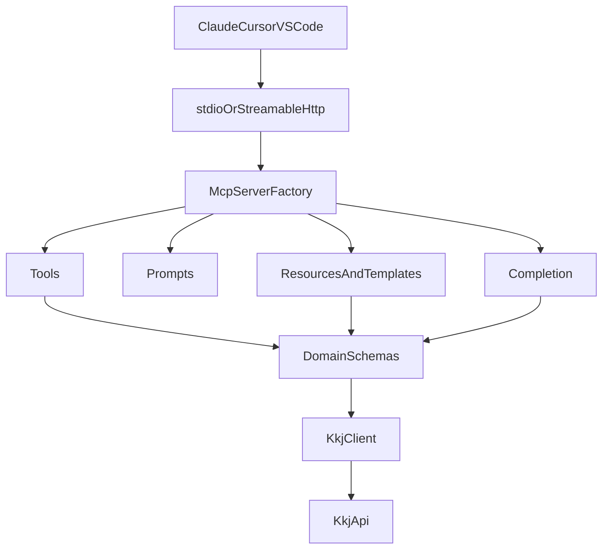

# Architecture

## 日本語

JP Bids MCP は、MCPのプリミティブを薄く保ち、KKJ API固有の処理を `api` と `domain` に閉じ込めます。

依存方向は `server -> mcp -> primitives -> api/domain -> lib` です。逆方向の依存は作りません。

## English

JP Bids MCP keeps MCP primitives thin and isolates KKJ-specific logic in `api` and `domain`.

The dependency direction is `server -> mcp -> primitives -> api/domain -> lib`. Reverse dependencies are not allowed.

## Bahasa Indonesia

JP Bids MCP menjaga primitive MCP tetap tipis dan mengisolasi logika khusus KKJ di `api` dan `domain`.

Arah dependensi adalah `server -> mcp -> primitives -> api/domain -> lib`. Dependensi terbalik tidak diperbolehkan.
