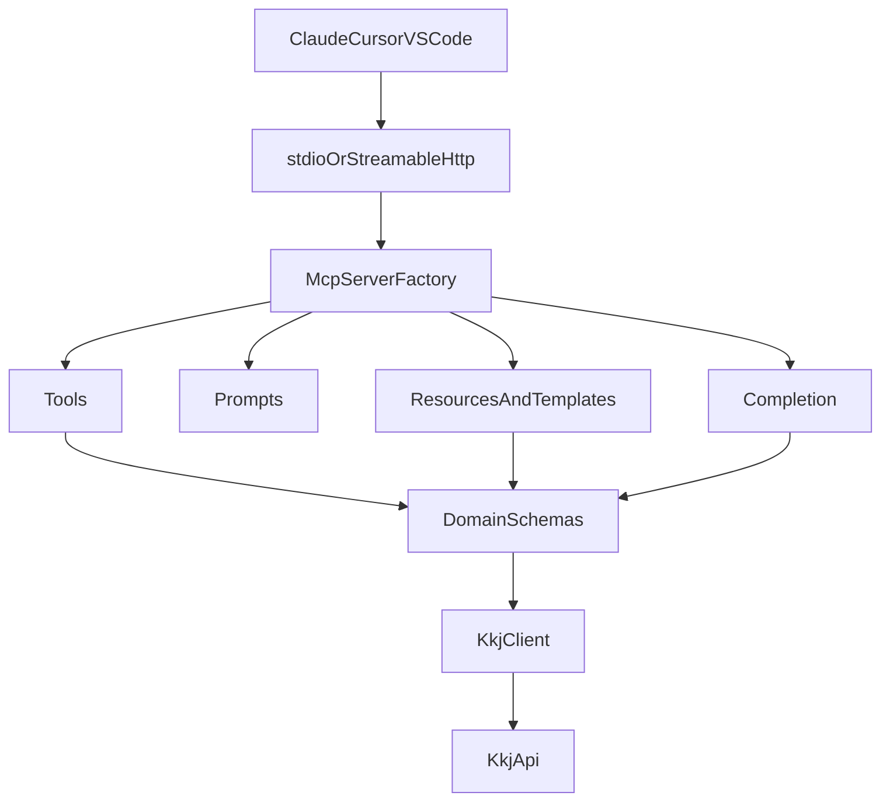

# Architecture

## 日本語

JP Bids MCP は、MCPのプリミティブを薄く保ち、KKJ API固有の処理を `api` と `domain` に閉じ込めます。

依存方向は `server -> mcp -> primitives -> api/domain -> lib` です。逆方向の依存は作りません。

`org://{organization_name}` や `bid://{bid_key}` のような動的Resource Templateは、LLMに巨大な検索結果を渡すのではなく、必要なコンテキストだけを読み取り専用で提供するために使います。現行の remote 版では OAuth 2.0 を提供し、Tasks と server-side Sampling は長時間処理やサーバー側 LLM 呼び出しの実需要が出た時点で検討します。

## English

JP Bids MCP keeps MCP primitives thin and isolates KKJ-specific logic in `api` and `domain`.

The dependency direction is `server -> mcp -> primitives -> api/domain -> lib`. Reverse dependencies are not allowed.

Dynamic Resource Templates such as `org://{organization_name}` and `bid://{bid_key}` provide only the context the model needs, instead of dumping large result sets into the context window. The current remote server provides OAuth 2.0; Tasks and server-side Sampling remain deferred until long-running workflows or server-side LLM calls justify them.

## Bahasa Indonesia

JP Bids MCP menjaga primitive MCP tetap tipis dan mengisolasi logika khusus KKJ di `api` dan `domain`.

Arah dependensi adalah `server -> mcp -> primitives -> api/domain -> lib`. Dependensi terbalik tidak diperbolehkan.

Resource Template dinamis seperti `org://{organization_name}` dan `bid://{bid_key}` menyediakan hanya konteks yang dibutuhkan model, bukan seluruh hasil pencarian besar. Server remote saat ini menyediakan OAuth 2.0; Tasks dan Sampling sisi server tetap ditunda sampai ada kebutuhan proses panjang atau pemanggilan LLM sisi server.
