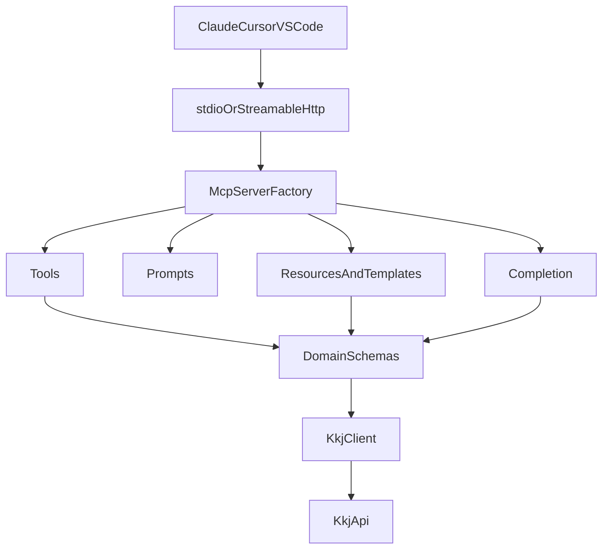

# Architecture

## 日本語

JP Bids MCP は、MCPのプリミティブを薄く保ち、KKJ API固有の処理を `api` と `domain` に閉じ込めます。

依存方向は `server -> mcp -> primitives -> api/domain -> lib` です。逆方向の依存は作りません。

`org://{organization_name}` や `bid://{bid_key}` のような動的Resource Templateは、LLMに巨大な検索結果を渡すのではなく、必要なコンテキストだけを読み取り専用で提供するために使います。Tasks、Sampling、OAuthは現時点では導入せず、長時間処理・サーバー側LLM呼び出し・企業認証の実需要が出た時点でADRを追加します。

## English

JP Bids MCP keeps MCP primitives thin and isolates KKJ-specific logic in `api` and `domain`.

The dependency direction is `server -> mcp -> primitives -> api/domain -> lib`. Reverse dependencies are not allowed.

Dynamic Resource Templates such as `org://{organization_name}` and `bid://{bid_key}` provide only the context the model needs, instead of dumping large result sets into the context window. Tasks, Sampling, and OAuth are intentionally deferred until long-running workflows, server-side LLM calls, or enterprise authentication requirements exist.

## Bahasa Indonesia

JP Bids MCP menjaga primitive MCP tetap tipis dan mengisolasi logika khusus KKJ di `api` dan `domain`.

Arah dependensi adalah `server -> mcp -> primitives -> api/domain -> lib`. Dependensi terbalik tidak diperbolehkan.

Resource Template dinamis seperti `org://{organization_name}` dan `bid://{bid_key}` menyediakan hanya konteks yang dibutuhkan model, bukan seluruh hasil pencarian besar. Tasks, Sampling, dan OAuth sengaja ditunda sampai ada kebutuhan proses jangka panjang, pemanggilan LLM sisi server, atau autentikasi enterprise.
