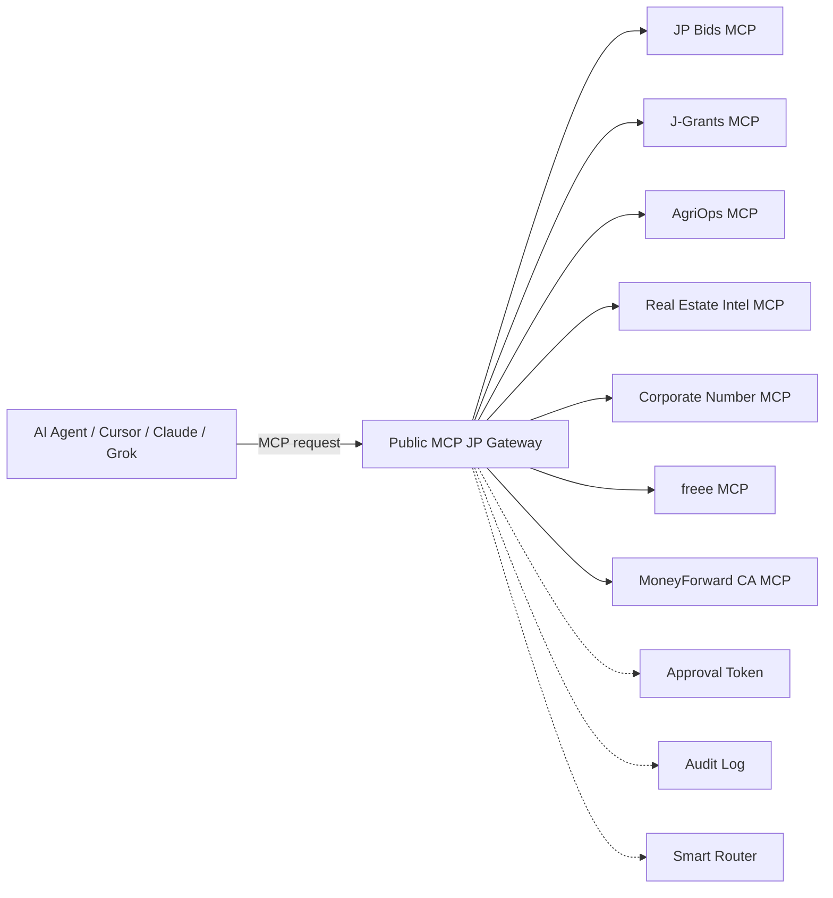
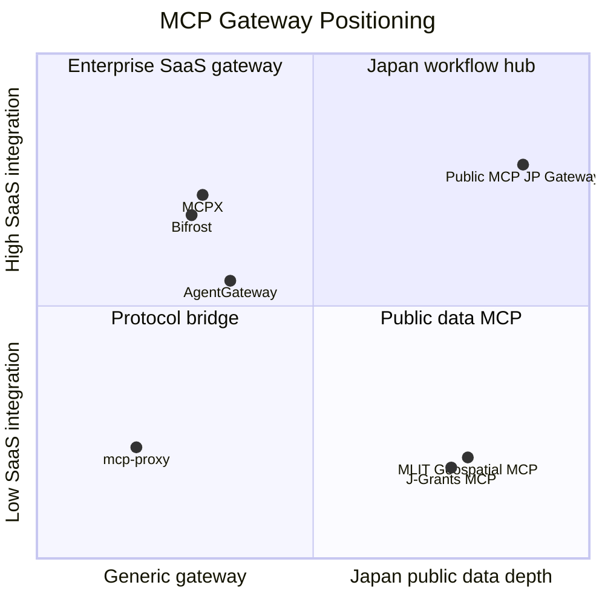

# Public MCP JP Gateway Strategic Overview

机の上には、いつも少しずつ違う画面が並びます。入札公告、補助金、法人番号、農業統計、不動産情報、会計ソフト。どれも公的で、どれも正しい場所にあります。しかし、経営の判断はそのどれか一つの画面だけでは終わりません。

Public MCP JP Gateway は、この分断された公的データと業務 SaaS を、AI エージェントが 1 つの接続先から扱えるようにするための日本向け MCP Federation Gateway です。

## Executive Summary

Public MCP JP Gateway は、日本の公的データ MCP と業務 SaaS MCP を束ね、AI エージェントが入札、補助金、法人確認、農業・自治体統計、不動産分析、会計確認を 1 つの会話で扱えるようにする Gateway です。

現在の公開構成では、JP Bids MCP、J-Grants MCP、AgriOps MCP、不動産インテル MCP、法人番号 MCP、freee MCP、MoneyForward Cloud Accounting MCP の 7 つの child MCP を registry で管理しています。GMO 銀行系 API は、利用許諾と API 取得が完了するまで公開 Gateway では提供せず、将来の private connector として扱います。

このプロダクトの価値は、単に MCP サーバーの数を増やすことではありません。AI エージェントに渡す tool surface を mode ごとに絞り、認証、監査、キャッシュ、承認、ルーティングを Gateway 側で一元化することにあります。Public MCP JP Gateway は、海外の汎用 MCP Gateway と正面から同じ土俵で競うのではなく、日本の制度、公的データ、会計 SaaS、地域経済データをつなぐ領域に集中します。

想定読者は、中小企業、行政書士、登録支援機関、農業法人、自治体、AI エージェント開発企業、大口 SaaS 事業者、投資家、将来の買収候補です。短期的には入札・補助金・法人確認・会計をつなぐ業務基盤として使われ、長期的には日本の制度データに強い agent-native workflow infrastructure へ進化することを目指します。

English summary: Public MCP JP Gateway is a Japan-focused MCP Federation Gateway that connects public procurement, subsidies, corporate registry, agriculture and municipality statistics, real estate intelligence, and accounting MCP servers through one agent endpoint. Its strategic position is not to become a generic global gateway clone, but to own the workflow layer where Japanese public data, compliance, and business SaaS meet.

## プロダクトの全体像

Public MCP JP Gateway は、複数の child MCP を 1 つの MCP endpoint に束ねる中継サービスです。

AI クライアントは Gateway だけに接続し、Gateway が registry に定義された child MCP へ proxy します。現在の本番エンドポイントは `https://mcp-gateway.jp/mcp` です。

現在の child MCP は次の通りです。

| child MCP | 主な領域 | risk_level | 現在の位置づけ |
|---|---|---|---|
| `jp-bids` | 官公需入札 | `read_only` | KKJ 入札情報の検索・詳細確認 |
| `jgrants` | 補助金・助成金 | `read_only` | J-Grants の補助金検索 |
| `agriops` | 農業・自治体統計 | `read_only` | 市区町村単位の農業統計 |
| `real-estate-intel` | 地価・取引・災害・人流 | `read_only` | 不動産・出店・地域投資分析 |
| `houjin-bangou` | 法人番号 | `read_only` | 法人実在確認・取引先照合 |
| `freee` | 会計・請求書 | `financial` | 会計データの参照 |
| `moneyforward-ca` | 仕訳・試算表・推移表 | `financial` | 会計分析と承認付き書き込み候補 |

GMO 銀行系 API は公開 Gateway の registry に登録していません。資金移動に関わる API は誤実行時の影響が大きく、API credential を公開 Gateway に持たせるべきではないためです。将来、利用許諾と契約範囲が確認できた場合に限り、社内利用または契約範囲内の private connector として扱います。

## できること

Public MCP JP Gateway でできることは、個別 API 呼び出しではなく、業務の順番を AI エージェントに渡すことです。

代表的な利用例は次の通りです。

| 利用例 | Gateway が呼び分ける child MCP | 得られる判断 |
|---|---|---|
| 鹿児島県の IT 入札を探す | JP Bids | 追うべき入札候補 |
| 入札に使える補助金を探す | J-Grants | 原資・助成可能性 |
| 取引先を確認する | 法人番号 | 法人実在性・名称・所在地 |
| 農業地域の市場性を見る | AgriOps | 市区町村単位の農業文脈 |
| 出店候補地を比較する | Real Estate Intel | 地価・取引・災害・人流の観点 |
| 会計上の余力を見る | freee / MoneyForward | 試算表・仕訳・請求状況 |
| 会計書き込み前に承認する | Approval Token | 誤実行防止と監査性 |

Gateway は mode によって tool surface を切り替えます。たとえば `bid_search` では入札検索に必要な tool だけを見せ、`financial_check` では会計参照に必要な tool だけを見せます。freee MCP のように多数の API を持つ child MCP をそのまま AI に見せるのではなく、目的ごとに見せる道具を狭くします。

## ターゲット

Public MCP JP Gateway の対象は、「公的データと業務データを横断して判断する人」です。

最初のターゲットは中小企業です。入札、補助金、法人確認、会計確認を別々の画面で行っている企業にとって、Gateway は調査の入口になります。次のターゲットは行政書士、登録支援機関、士業、補助金支援者です。彼らは制度の一次情報を扱う必要があり、AI が勝手に要約した情報だけでは不十分です。

さらに、農業法人、自治体、地域進出を検討する事業者にとっては、AgriOps と Real Estate Intel の組み合わせが価値を持ちます。農業生産、人口、地価、災害、人流、法人情報を同じ会話で参照できるからです。

最後に、AI エージェント開発企業にとっては、Public MCP JP Gateway は日本向け agent workflow の substrate になります。各社が入札、補助金、法人番号、会計、地域統計の connector を一つずつ作らなくても、Gateway を通じて一定の制度文脈を利用できます。

| ターゲット | 主な痛み | 提供価値 |
|---|---|---|
| 中小企業 | 入札・補助金・会計が分断 | 1 会話で調査から判断へ |
| 行政書士・士業 | 一次情報確認に時間がかかる | 出典付きの照会導線 |
| 登録支援機関 | 人材・地域・制度の横断が必要 | 将来の Workforce Intel と接続 |
| 農業法人・自治体 | 地域データが散在 | AgriOps と不動産分析を統合 |
| AI エージェント企業 | 日本の公的データ connector が不足 | Gateway 経由で制度データに接続 |
| 投資家・買収候補 | MCP の事業化仮説を見たい | 日本特化の Federation Hub という資産 |

## 価値

Public MCP JP Gateway の価値は、時短、信頼、拡張性の 3 つに分けられます。

第一に、時短です。入札、補助金、法人確認、会計確認をそれぞれの画面で行う作業を、AI エージェントの連続した会話に近づけます。ユーザーは「どこを開くか」ではなく「何を判断したいか」から始められます。

第二に、信頼です。Gateway は入力全文や個人情報、財務データを保存しない方針を取り、監査ログには request id、actor hash、tool name、decision、latency などの最小メタデータを残します。会計の書き込み系 tool には Approval Token と compliance check を要求します。

第三に、拡張性です。ADR-0016 で Gateway を JP Bids MCP 本体から分離し、ADR-0022 で child MCP 追加を registry-driven にしました。新しい child MCP は、原則として `gateway/config/registry.json` に 1 エントリ追加し、Cloud Run の endpoint 環境変数を設定することで接続できます。

この価値は、単体 MCP では出しにくいものです。JP Bids MCP は入札に強く、J-Grants MCP は補助金に強く、MoneyForward は会計に強い。しかし、経営判断はその間に生まれます。Gateway は、その間を扱います。

## 世界の MCP Gateway 事情

MCP Gateway は、2026 年時点で AI エージェント基盤の独立カテゴリになり始めています。

背景には、MCP サーバーが増えすぎる問題があります。AI クライアントが個別に数十から数百の tool definition を抱えると、認証、権限、監査、レイテンシ、誤実行防止をクライアント側だけで扱えなくなります。2026 年 Q1 の ecosystem 調査では、aggregation、gateway、proxy の周辺ツールが 17 から 18 程度に増えていると整理されています（出典: [MCP Aggregation, Gateway, and Proxy Tools: State of the Ecosystem Q1 2026](https://www.heyitworks.tech/blog/mcp-aggregation-gateway-proxy-tools-q1-2026)）。そこで、複数 MCP を集約し、policy と routing を一箇所で管理する Gateway が出てきました。

主なプレイヤーは次の通りです。

| プレイヤー | 位置づけ | 強み | Public MCP JP Gateway との差分 |
|---|---|---|---|
| [AgentGateway](https://agentgateway.dev) | Linux Foundation 系 OSS gateway | MCP / A2A / HTTP / gRPC、Rust、RBAC、OpenTelemetry。2026 年 5 月時点の検索結果では 2,600 stars 超、140 contributors と報告 | 汎用 gateway。日本公的データは持たない |
| mcp-proxy | Python 系 transport bridge | stdio / SSE / HTTP の bridge | federation より transport 変換が中心 |
| [Bifrost](https://www.getmaxim.ai/bifrost/resources/mcp-gateway) | Maxim AI の高性能 gateway | 11 microseconds overhead、5K RPS、tool discovery、OAuth、Code Mode といった性能訴求 | 性能と LLM provider gateway に強い |
| [Lunar.dev MCPX](https://docs.lunar.dev/mcpx) | Enterprise MCP gateway | tool level、service level、consumer level、global level の RBAC、監査、risk score | security governance が中心 |
| [Smithery](https://smithery.ai) | MCP marketplace / registry | discovery、deployment、hosted registry、Free / Pro / Enterprise 型の商用導線 | marketplace。日本制度 workflow ではない |
| [MCP Registry / signed registry](https://modelcontextprotocol.io/registry/about) | 信頼された MCP registry | DNS verification、REST discovery、signing、trusted publisher、supply chain integrity | registry layer。業務 orchestration ではない |
| [Cloudflare MCP Server Portals](https://developers.cloudflare.com/cloudflare-one/access-controls/ai-controls/mcp-portals/) | edge-native MCP portal | single HTTP endpoint、OAuth secured MCP、tool customization、code mode、Gateway log / DLP 連携 | enterprise access と edge 運用が中心 |
| Microsoft / AWS / Azure 系 gateway | hyperscaler-native gateway | cloud-native identity、agent platform 統合 | hyperscaler ecosystem 中心 |
| Kong / Portkey / Obot / IBM ContextForge | enterprise gateway 周辺 | catalog、composite server、RBAC、observability、federated registry | 日本固有の公的データは対象外 |

世界の Gateway 論点は、主に 5 つです。

| 論点 | 意味 | 重要性 |
|---|---|---|
| Federation reach | 複数 cloud / self-hosted / SaaS を束ねられるか | 大企業導入の前提 |
| Auth conformance | OAuth 2.1、PKCE、resource indicator など | token の安全な委任 |
| Identity propagation | agent が誰の代理で呼んだか | 監査と責任分界 |
| Audit granularity | tool name、args、decision、policy snapshot | インシデント時の説明責任 |
| Revocation timing | 権限変更がいつ反映されるか | 誤実行・退職者アクセス防止 |

もう一つの大きな論点は、1:1 mapping と nested federation です。単純な gateway は 1 つの endpoint を 1 つの namespace に写します。しかし、実際の企業利用では「部署別」「用途別」「権限別」「国別」「顧客別」に Gateway を重ねる必要が出ます。将来的には、Gateway が別の Gateway を child MCP として扱う nested federation が標準的な構成になります。

この市場で注目すべきことは、Gateway の価値が transport 変換から governance へ移っている点です。最初の課題は stdio、SSE、Streamable HTTP をつなぐことでした。しかし、企業が本番で求めるのは、誰が、どの代理権限で、どの tool を、どの policy snapshot のもとで呼んだかを説明できることです。Cloudflare が MCP portal traffic を Gateway HTTP logs や DLP と結びつけていること、MCPX が consumer tag と tool-level policy を打ち出していること、Obot や ContextForge が catalog / composite server / federated registry を語っていることは、同じ方向を示しています。

Public MCP JP Gateway は、この世界的な流れの中で、日本の制度データと業務 SaaS に特化した federation layer として位置づけられます。

## 競合状況

Public MCP JP Gateway の競合は、単一の会社ではなく、カテゴリごとに分かれます。

海外勢は、汎用 Gateway、security gateway、marketplace、enterprise agent platform に強みを持っています。一方で、日本の官公需、補助金、法人番号、農業統計、会計 SaaS、将来の特定技能・在留資格領域をまとめて扱う設計は、現時点ではかなり狭い領域です。その狭さが弱みではなく、参入障壁になります。

| カテゴリ | 代表例 | 競合度 | Public MCP JP Gateway の勝ち筋 |
|---|---|---|---|
| Security Gateway | Permit, Lunar MCPX, PingGateway | 中 | 日本制度データを内包しない |
| Agent Gateway | AgentGateway, Bifrost, Kong, Portkey | 中 | 汎用基盤であり、領域特化ではない |
| MCP Marketplace | Smithery, Anthropic registry | 低から中 | 発見・配布が中心で workflow ではない |
| Public Data MCP | J-Grants MCP, MLIT 地理空間 MCP | 低 | 単体 MCP。Gateway 層ではない |
| 業務 SaaS MCP | freee MCP, MoneyForward MCP | 中 | 会計特化。入札・補助金・地域統計までは束ねない |
| 日本向け Federation Hub | Public MCP JP Gateway | 直接競合は限定的 | 日本の制度 workflow を束ねる |

国内で特に重要なのは、デジタル庁の J-Grants MCP と国土交通省の地理空間 MCP です。デジタル庁は 2025 年 10 月 24 日に J-Grants の API を MCP サーバーとして実装・公開し、自然言語で補助金検索や参照ができる例を示しました。国土交通省は 2026 年 2 月 26 日に地理空間 MCP Server の alpha 版を公開し、不動産情報ライブラリ API 由来の複数データを自然言語で扱う方向を示しています。

これらは競合であると同時に、Gateway から接続されるべき公的データ MCP でもあります。Public MCP JP Gateway の立場は、それらを置き換えることではありません。むしろ、それらの価値を AI エージェントの業務フローの中で使えるようにすることです。

競合優位は、次の 4 つに分かれます。

| 優位性 | 内容 | 真似しにくい理由 |
|---|---|---|
| 制度文脈 | KKJ、J-Grants、法人番号、会計、特定技能を同時に扱う | API 接続だけでなく運用ルールが必要 |
| Gateway 実装 | registry、mode、policy、audit、approval を分離 | child MCP 追加と governance が両立する |
| 公開実績 | Zenn、Note 原稿、ADR、production verification | コード以外の信頼資産が残る |
| ドメイン拡張 | AgriOps、Real Estate Intel、Workforce Intel へ広げられる | 地域・労働・会計を横断できる |

競争軸を図にすると、次のようになります。

この図は市場占有率ではなく、ポジショニングの整理です。Public MCP JP Gateway は、汎用 Gateway と性能勝負をするよりも、日本の制度データ深度と業務 SaaS 統合度の交差点を狙います。

## JP Bids MCP から Gateway への進化

Public MCP JP Gateway は、JP Bids MCP を肥大化させず、別サービスとして作ったことに意味があります。

JP Bids MCP は、官公需情報ポータルサイト（KKJ）に特化した読み取り専用 MCP です。自社ヒアリングに基づく既存記事では、従来 2 時間 15 分かかっていた入札調査が約 2 分に短縮されたと整理しています。この成果は、KKJ という一つの制度データに深く入り、出典明記、添付資料 URI の扱い、stdout を壊さない logging、KKJ API への過剰アクセス回避など、単一責任の品質を守った結果です。

しかし、入札調査だけでは経営判断は終わりません。案件を見つけたあとには、「補助金を使えるか」「取引先は実在するか」「資金繰りは大丈夫か」「地域の産業構造は合っているか」という問いが続きます。ここで JP Bids MCP 本体を肥大化させると、reference implementation としての明快さが失われます。

一方で、Gateway は OAuth token の pass-through、financial risk、Approval Token、child MCP routing、audit log などを扱います。入札検索と会計書き込み候補は、同じ risk profile ではありません。そのため、ADR-0016 では `gateway/` を独立した TypeScript package として分離しました。

この分離は、将来の売却や提携にも意味を持ちます。JP Bids MCP は公的入札データの reference implementation として残し、Public MCP JP Gateway は Federation Hub として独立に評価できます。片方の戦略変更がもう片方の品質を壊しません。

## 今後のプラン

Public MCP JP Gateway の今後の計画は、child MCP を増やすことではなく、業務の流れが完成する組み合わせを増やすことです。

ADR-0022 では、次の Expansion Packs を定義しています。

| Phase | child MCP / Pack | 状態 | 主な価値 |
|---|---|---|---|
| 1 | AgriOps | registry 登録済み | 農業・自治体・地域文脈 |
| 2 | 法人番号 MCP | registry 登録済み | 法人実在確認・取引先照合 |
| 3 | e-Stat / RESAS MCP | 検討・接続候補 | 人口・産業・就業・地域経済 |
| 4 | e-Gov 法令検索 MCP | 検討・接続候補 | 法令・行政手続の一次情報 |
| 5 | SSW / Visa MCP | 検討・接続候補 | 在留期限・届出・配置可否 |
| 6 | Japan Workforce Intel MCP | 新規構想 | 特定技能・労働市場・支援機関分析 |

特に Japan Workforce Intel MCP は、今後の重要な child MCP 候補です。特定技能外国人数、登録支援機関数、労働力人口、産業別需要、農業生産量、自治体データを掛け合わせ、「どの地域に進出するべきか」「どの業界に人材需要があるか」「支援機関が少なく、需要が高い空白地帯はどこか」を判断するための分析 MCP になります。

Vertical Bundle としては、次のような提供単位が考えられます。

| Bundle | 含む child MCP | 対象ユーザー |
|---|---|---|
| Public Sales Pack | JP Bids + J-Grants + 法人番号 | 入札・補助金を探す企業 |
| Agri Expansion Pack | AgriOps + e-Stat + JP Bids + J-Grants | 農業法人・自治体・派遣会社 |
| Finance Pack | freee + MoneyForward + 法人番号 | 経理・財務担当者 |
| Compliance Pack | SSW / Visa + e-Gov + audit log | 行政書士・登録支援機関 |
| Workforce Intel Pack | Workforce Intel + AgriOps + Real Estate Intel | 地域進出・外国人材戦略 |

今後 90 日の現実的な進め方は、機能追加よりも「信頼を増やす順序」を優先します。

| 期間 | 主な作業 | 成果物 |
|---|---|---|
| Day 1-30 | 本番安定化、demo 導線、利用ログの最小収集 | private beta 用の導入手順と事例 |
| Day 31-60 | e-Stat / RESAS / e-Gov の read-only connector 検証 | 地域統計と法令参照の proof |
| Day 61-90 | Japan Workforce Intel MCP の MVP 設計と PoC | 外国人材・地域進出分析の prototype |

この順序にする理由は、AI エージェントの業務基盤では、機能数より先に信頼が必要だからです。まず「つながる」「落ちない」「ログが説明できる」「危険な操作は止まる」を固め、その上で Workforce Intel のような分析価値を重ねます。

## ビジネスモデル仮説

Public MCP JP Gateway のビジネスモデルは、Free、Pro、Enterprise の 3 tier が自然です。

Free は demo、read-only public data、低頻度利用に向きます。Pro は会計連携、監査ログ、Approval Token、横断分析に向きます。Enterprise は専用 Gateway、private connector、閉域 Cloud Run、組織単位の policy、監査 export、SLA に向きます。

| Tier | 想定ユーザー | 提供価値 | 課金仮説 |
|---|---|---|---|
| Free | 個人開発者・小規模事業者 | 公開データ検索と demo | 無料または低 call quota |
| Pro | 中小企業・士業 | 会計連携、横断分析、監査ログ | 月額数千円から数万円 |
| Enterprise | SaaS 企業・自治体・大企業 | private connector、SLA、専用 policy | 個別見積 |

Smithery のような MCP marketplace は、Free call quota、Pro 月額、Enterprise custom という形を取っています。Public MCP JP Gateway も同じ価格体系をそのまま真似る必要はありませんが、MCP の課金単位が「席数」だけではなく「tool call」「connector」「policy」「audit」に分かれることは参考になります。

初期の売上仮説は、まず Pro ではなく Enterprise にあります。理由は、Public MCP JP Gateway の本当の価値が「便利な検索」ではなく、組織の agent tool governance にあるからです。監査ログ、権限、private connector、API credential を預からない設計は、個人よりも組織が支払う価値です。

中期的には、利用量課金だけに寄せすぎない方が安全です。公的データは call volume が読みにくく、会計・認証・監査は call 数より責任の重さで価値が決まります。そのため、価格の中心は「connector 数」「組織 policy」「private deployment」「audit export」「SLA」に置く方が自然です。

ARR は、現時点では実績ではなく仮説として扱うべきです。公開資料で強く言い切る数字ではありませんが、事業性を検討するためのレンジは次のように置けます。

| シナリオ | 顧客構成 | 月額単価仮説 | ARR 仮説 |
|---|---|---|---|
| Seed | Pro 30 社 + Enterprise 2 社 | Pro 1 万円、Enterprise 20 万円 | 約 840 万円 |
| Base | Pro 100 社 + Enterprise 10 社 | Pro 1.5 万円、Enterprise 30 万円 | 約 5,400 万円 |
| Expansion | Pro 300 社 + Enterprise 30 社 | Pro 2 万円、Enterprise 50 万円 | 約 2.52 億円 |

この表は売上予測ではなく、どの顧客層を取れば事業として成立し始めるかを見るための感度分析です。実際の価格は、private beta の利用頻度、監査ログへの支払い意思、会計・法人番号・Workforce Intel の利用深度を見て決めます。

## 売却の夢

Public MCP JP Gateway の売却可能性は、「MCP Gateway が世界的カテゴリになること」と「日本の制度データに強い Gateway が希少であること」の掛け算で生まれます。

これは確約された出口ではありません。あくまで、プロダクトを育てる方向を間違えないための長期仮説です。売却を目的に誇張するのではなく、買われ得るほど整理された資産にすることが重要です。

想定される買い手は 4 種類です。

| 買い手候補 | 買う理由 | 必要な証拠 |
|---|---|---|
| 国内 SaaS 大手 | 会計・人事・申請業務を agent-native にしたい | 有料顧客、OAuth 連携実績 |
| 海外 Gateway 勢 | 日本市場に入る制度 connector が欲しい | 日本公的データ coverage、英語資料 |
| SIer・コンサル | 自治体・中小企業 DX の提案部品にしたい | 導入事例、監査・権限管理 |
| クラウド事業者 | MCP tool governance を platform 化したい | Cloud Run 運用実績、SLA 設計 |

売却構造としては、株式譲渡、事業譲渡、資産売却、アクハイアの 4 つが考えられます。ただし、Public MCP JP Gateway を本当に価値ある資産にするには、コードだけでは足りません。registry、ADR、security policy、production verification、記事、出典、利用実績、顧客の声まで含めた「買収後に引き継げる状態」が必要です。

長期的には、日本の制度文脈に閉じない Federation Hub へ広げられます。日本で作った強みは、制度が複雑な国ほど効きます。インドネシア、韓国、台湾、EU 圏など、公共データ、法人 registry、補助金、労働、会計 SaaS が分断されている市場では、同じ構造が使えます。

ただし、出口の前に必要なのは、売却資料ではなく運用品質です。買われるために派手に見せるのではなく、買収後に壊れないように作ることです。仕様、テスト、ADR、監査、出典、運用手順が揃っているほど、プロダクトは創業者個人から少しずつ独立します。

## リスクと前提

Public MCP JP Gateway には、技術、規制、市場のリスクがあります。

第一に、MCP 仕様そのものが進化中です。Logging、Resource Templates、Completion、OAuth 2.1、Server Card、MCP Apps などの周辺仕様は変化します。Gateway は公式仕様を優先し、独自仕様を増やしすぎない必要があります。

第二に、公的 API の規約変更リスクがあります。KKJ、J-Grants、法人番号、e-Stat、RESAS、e-Gov などは、それぞれ利用規約、rate limit、API key、データライセンスが異なります。Gateway は出典と attribution を保持し、添付資料や大規模 raw data を保存しない方針を続ける必要があります。

第三に、financial MCP のリスクがあります。freee や MoneyForward のような会計データは、public data と同じ扱いにできません。キャッシュ禁止、OAuth pass-through、Approval Token、audit log の最小化を徹底する必要があります。

第四に、GMO 銀行系 API の扱いです。現時点では公開 Gateway の機能として説明してはいけません。利用許諾と API 取得が完了した後、private connector としてのみ扱う方針を維持します。

第五に、市場タイミングです。MCP Gateway が急速に標準化される場合、汎用 Gateway そのものは commodity になります。そのとき価値を残すのは、Gateway 実装ではなく、どの制度データを、どの業務順序で、どの責任境界でつないだかです。

## 出典・参考資料

Public MCP JP Gateway の設計根拠は、リポジトリ内の ADR と外部の MCP Gateway 調査に分かれます。

### 内部資料

- [ADR-0016: Public MCP Federation Hub](../adr/0016-public-mcp-federation-hub.md)
- [ADR-0017: Dynamic Tool Surface](../adr/0017-dynamic-tool-surface.md)
- [ADR-0018: Cache Strategy](../adr/0018-cache-strategy.md)
- [ADR-0019: Approval and Compliance Policy](../adr/0019-approval-and-compliance-policy.md)
- [ADR-0020: LLM Router Fallback](../adr/0020-llm-router-fallback.md)
- [ADR-0021: MoneyForward Accounting MCP Integration](../adr/0021-moneyforward-accounting-mcp-integration.md)
- [ADR-0022: Gateway Expansion Packs](../adr/0022-gateway-expansion-packs.md)
- [Public MCP Federation Hub feasibility memo](../public-mcp-hub/feasibility.md)
- [Public MCP JP Gateway status report](../public-mcp-hub/status-report-2026-05-07.md)
- [GMO Banking Private Connector Policy](../public-mcp-hub/gmo-banking-private-connector.md)
- [Public MCP JP Gateway Zenn article](../../articles/public-mcp-jp-gateway.md)
- [OAuth pass-through Zenn article](../../articles/mcp-gateway-oauth-passthrough.md)

### 外部資料

- [Model Context Protocol](https://modelcontextprotocol.io)
- [The MCP Registry](https://modelcontextprotocol.io/registry/about)
- [AgentGateway](https://agentgateway.dev)
- [AgentGateway GitHub](https://github.com/agentgateway/agentgateway)
- [Bifrost MCP Gateway](https://www.getmaxim.ai/bifrost/resources/mcp-gateway)
- [Lunar.dev MCPX](https://docs.lunar.dev/mcpx)
- [Lunar.dev MCP access controls](https://lunar.dev/post/mcp-gateway-access-controls-defining-permissions-for-llm-agents)
- [Smithery](https://smithery.ai)
- [Cloudflare MCP server portals](https://developers.cloudflare.com/cloudflare-one/access-controls/ai-controls/mcp-portals/)
- [Cloudflare Gateway routing for MCP portal traffic](https://developers.cloudflare.com/changelog/post/2026-03-20-mcp-portal-gateway-routing/)
- [Obot MCP Gateway comparison](https://obot.ai/blog/the-13-best-mcp-gateways-for-enterprise-teams/)
- [Explore Agentic MCP Gateway vendor selection guide](https://www.exploreagentic.ai/mcp-gateway/)
- [MCP Aggregation, Gateway, and Proxy Tools: State of the Ecosystem Q1 2026](https://www.heyitworks.tech/blog/mcp-aggregation-gateway-proxy-tools-q1-2026)
- [Digital Applied MCP Adoption Statistics 2026](https://www.digitalapplied.com/blog/mcp-adoption-statistics-2026-model-context-protocol)
- [e-Stat API](https://www.e-stat.go.jp/api/)
- [国税庁 法人番号公表サイト Web-API](https://www.houjin-bangou.nta.go.jp/webapi/)
- [デジタル庁 J-Grants MCP server](https://github.com/digital-go-jp/jgrants-mcp-server)
- [デジタル庁 J-Grants MCP 実装例](https://digital-gov.note.jp/n/n09dfb9fa4e8e)
- [国土交通省 地理空間 MCP Server](https://www.mlit.go.jp/tochi_fudousan_kensetsugyo/tochi_fudousan_kensetsugyo_fr17_000001_00047.html)
- [J-Grants](https://www.jgrants-portal.go.jp)
- [官公需情報ポータルサイト KKJ](https://kkj.go.jp)
- [freee Developer](https://developer.freee.co.jp)
- [MoneyForward Cloud Accounting MCP](https://developers.biz.moneyforward.com/mcp/)

## 最後に

Public MCP JP Gateway は、派手なチャット画面を作るためのものではありません。AI が制度と業務の中に入るとき、どの扉を通り、どの記録を残し、どの情報を持たないかを決めるためのものです。

公的な事実は、ただのデータではありません。制度が外に出した、最小単位の約束です。Gateway は、その約束を AI エージェントの手に渡すとき、封を破らないための中継器でなければなりません。
